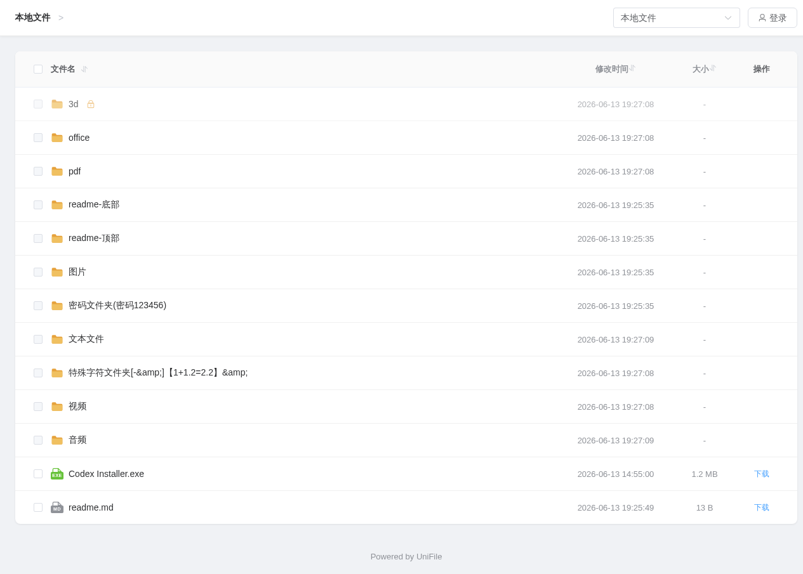
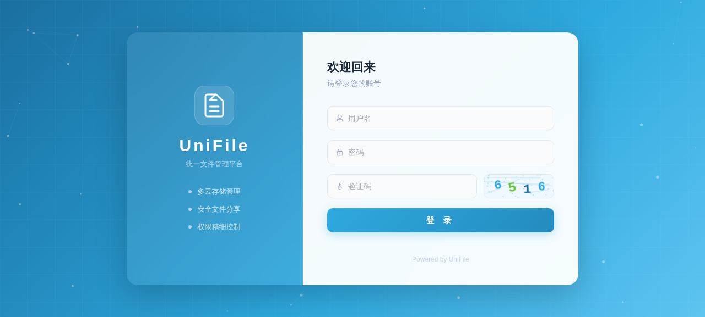
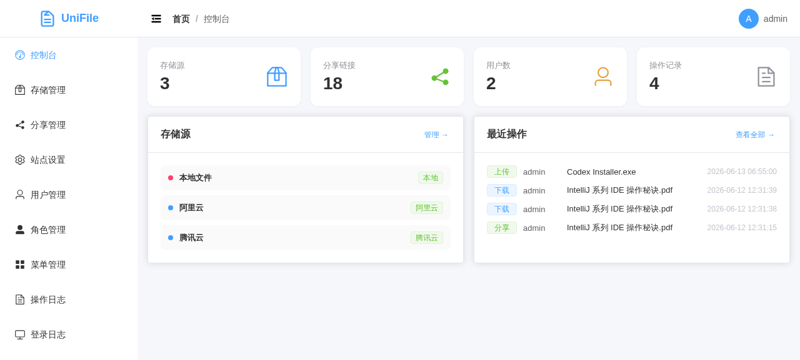
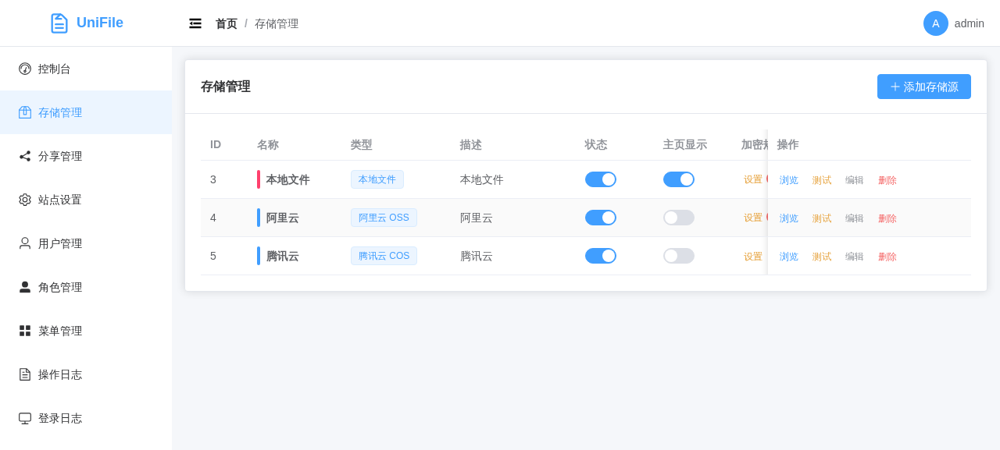
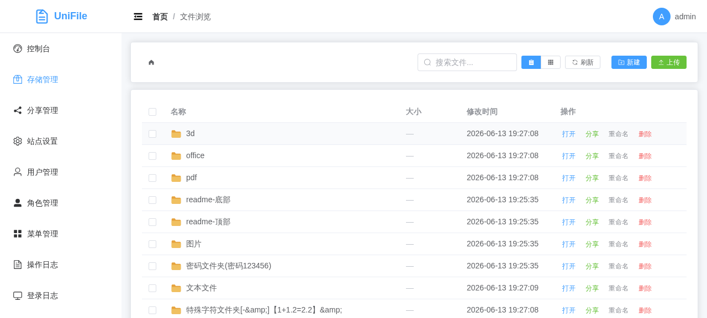
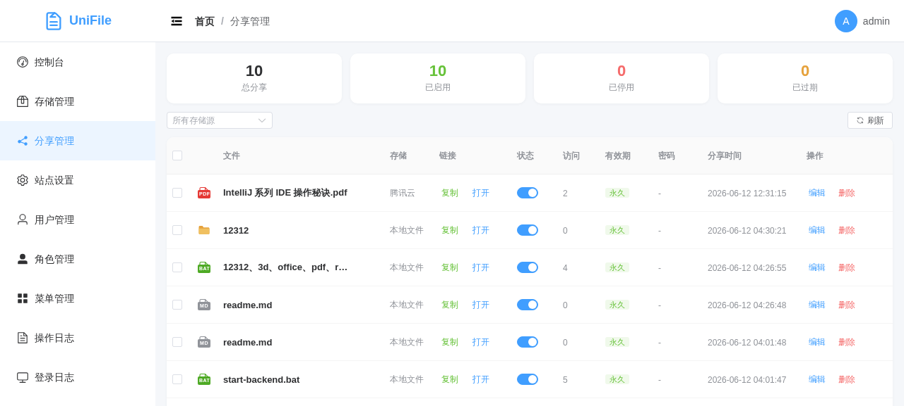

# UniFile — 统一文件管理平台

一个基于 FastAPI + Vue 3 + Element Plus 的多云存储统一管理平台，支持多种云存储服务的文件管理、分享、权限控制等功能。

## ✨ 功能特性

### 📦 多云存储管理
- 支持 8 种存储类型：
  - 阿里云 OSS
  - 华为云 OBS
  - 腾讯云 COS
  - 百度云 BOS
  - 又拍云 USS
  - 七牛云 Kodo
  - 火山引擎 TOS
  - 本地文件系统
- 存储源配置支持 Endpoint 下拉选择
- 存储源启用/禁用控制
- 连接测试功能
- 拖拽排序

### 📁 文件管理
- 文件列表浏览（列表/网格视图）
- 文件上传（支持文件夹上传）
- 文件下载、预览
- 文件移动、复制、重命名、删除
- 文件搜索
- 批量操作（批量分享、移动、删除）
- 直链复制

### 👁️ 文件预览
- **图片**: jpg, jpeg, png, gif, svg, webp, bmp, ico, avif
- **视频**: mp4, webm, ogg, mov, mkv, avi
- **音频**: mp3, wav, ogg, flac, aac, m4a
- **文档**: pdf
- **文本/代码**: txt, md, json, xml, csv, log, ini, yaml, yml, toml, cfg, conf, env, html, css, js, ts, jsx, tsx, vue, svelte, styl, py, java, go, rs, c, cpp, h, hpp, cs, rb, php, swift, kt, scala, lua, r, m, pl, pm, clj, erl, jl, pas, scm, tcl, coffee, bf, vb, vbs, sh, bash, zsh, bat, ps1, cmd, sql, graphql, proto, dockerfile, makefile, gitignore, editorconfig
- 文本文件使用 fetch + pre 渲染，不依赖 Content-Type
- 支持 kkFileView 预览服务器集成
- 预览失败时提供下载兜底

### 🔗 分享系统
- 创建文件/文件夹/多文件分享
- 分享密码保护
- 访问次数限制
- 过期时间设置
- 允许下载控制
- 存储源筛选
- 分享页面支持完整文件预览

### 🔒 权限控制 (RBAC)
- 基于角色的访问控制
- 动态菜单管理
- 按钮级权限控制
- 预设角色：管理员、普通用户、游客

### 🏠 首页公开访问
- 存储源可设置为首页显示
- 游客无需登录即可访问
- 支持 Glob 表达式加密规则
- 文件夹密码保护
- 密码继承（输入一次密码可访问子目录）
- 文件预览、直链复制

### ⚙️ 站点设置
- 站点名称、描述、Logo、Favicon
- ICP 备案号
- 预览服务器地址（kkFileView 集成）
- 登录入口显示/隐藏控制
- 图片验证码启用/禁用控制

### 📊 其他功能
- 操作日志记录
- 登录日志记录
- 控制台统计面板
- 响应式设计（移动端适配）
- 备份管理

## 🎨 界面主题

统一采用蓝色主题色 `#2EA9DF`，覆盖：
- 登录页（渐变背景 + 粒子动画 + 毛玻璃效果）
- 后台管理（深色侧边栏 + 蓝色高亮）
- 首页公开访问
- 分享页面

## 📸 系统截图

### 首页（公开访问）


### 登录页


### 控制台


### 存储管理


### 文件管理


### 分享管理


## 🛠️ 技术栈

### 后端
- **框架**: FastAPI
- **数据库**: SQLite (SQLAlchemy async)
- **认证**: JWT (python-jose)
- **密码**: bcrypt
- **HTTP 客户端**: httpx（云存储代理）

### 前端
- **框架**: Vue 3 + TypeScript
- **构建**: Vite
- **UI**: Element Plus
- **路由**: Vue Router
- **状态**: Pinia
- **HTTP**: Axios

## 📦 安装部署

### 环境要求
- Python 3.10+
- Node.js 18+
- npm 或 pnpm

### 1. 克隆项目
```bash
git clone https://github.com/ewbang/unifile
cd unifile
```

### 2. 后端部署
```bash
cd backend

# 创建虚拟环境
python -m venv .venv
source .venv/bin/activate  # Linux/Mac
# 或 .venv\Scripts\activate  # Windows

# 安装依赖
pip install -r requirements.txt

# 启动服务
uvicorn app.main:app --host 0.0.0.0 --port 8000 --reload
```

### 3. 前端部署
```bash
cd frontend

# 安装依赖
npm install

# 开发模式
npm run dev

# 生产构建
npm run build
```

### 4. 访问系统
- 首页（游客）: http://localhost:5173/
- 后台管理: http://localhost:5173/admin/dashboard
- 默认账号: `admin` / `admin123`

## 💻 本地开发

```bash
# 一键启动
./dev.sh start

# 停止服务
./dev.sh stop
```

- 后端: http://localhost:8000
- 前端: http://localhost:5173

## 📁 项目结构

```
unifile/
├── backend/                # 后端代码
├── frontend/               # 前端代码
├── dev.sh                  # 本地开发脚本
└── README.md               # 项目说明
```

## 🔧 配置说明

### 环境变量
后端支持以下环境变量配置（可在 `app/core/config.py` 中修改）：

| 变量名 | 默认值 | 说明 |
|--------|--------|------|
| `APP_NAME` | UniFile | 应用名称 |
| `APP_VERSION` | 1.0.0 | 应用版本 |
| `HOST` | 0.0.0.0 | 监听地址 |
| `PORT` | 8000 | 监听端口 |
| `SECRET_KEY` | 自动生成 | JWT 密钥 |
| `ACCESS_TOKEN_EXPIRE_MINUTES` | 1440 | Token 过期时间(分钟) |

### 数据库
- 默认使用 SQLite，数据库文件位于 `~/.unifile/db/unifile.db`
- 首次启动自动创建表结构和默认数据

### 站点设置

| 设置项 | 说明 | 默认值 |
|--------|------|--------|
| 站点名称 | 页面标题和品牌名 | UniFile |
| 站点描述 | 首页描述文字 | 统一文件管理系统 |
| 站点 Logo | 页面 Logo 图片 | - |
| 站点 Favicon | 浏览器图标 | - |
| ICP 备案号 | 页脚备案信息 | - |
| 预览服务器 | kkFileView 地址 | - |
| 登录入口 | 首页是否显示登录按钮 | 显示 |
| 图片验证码 | 登录时是否需要验证码 | 启用 |

### 存储源配置
每个存储类型有不同的配置字段，Endpoint 支持下拉选择常用区域：

**阿里云 OSS**:
- AccessKey ID / Secret
- Bucket 名称
- Endpoint（下拉选择）
- 自定义域名（可选）
- 路径前缀（可选）

**华为云 OBS**:
- Access Key ID / Secret
- Bucket 名称
- Endpoint（下拉选择）
- 自定义域名（可选）

**腾讯云 COS**:
- SecretId / SecretKey
- Bucket 名称
- Region
- 自定义域名（可选）

## 🔐 加密规则

首页公开访问支持 Glob 表达式加密规则：

| 规则 | 说明 |
|------|------|
| `/` | 根路径需要密码 |
| `/music/*` | music 文件夹需要密码，子文件夹不加密 |
| `/music/**` | music 及所有子目录需要密码 |
| `/data/[0-9]*` | 匹配 data 下以数字开头的目录 |

**特性**：
- 规则按顺序匹配，第一个匹配的规则生效
- 支持拖拽调整规则优先级
- 子目录继承父目录的密码（输入一次密码即可访问子目录）

## 📡 API 文档

启动后端后访问：
- Swagger UI: http://localhost:8000/docs
- ReDoc: http://localhost:8000/redoc

### 主要 API 端点

| 端点 | 说明 |
|------|------|
| `POST /api/auth/login` | 用户登录 |
| `GET /api/storages/` | 获取存储源列表 |
| `GET /api/files/{id}/list` | 获取文件列表 |
| `GET /api/files/{id}/preview` | 文件预览（流式代理） |
| `POST /api/shares/` | 创建分享 |
| `GET /api/shares/access/{code}` | 访问分享 |
| `GET /api/home/storages` | 获取公开存储源 |
| `GET /api/home/{id}/list` | 公开文件列表 |
| `GET /api/home/{id}/preview` | 公开文件预览 |
| `GET /api/home/{id}/preview-url` | 获取预览 URL |
| `GET /api/settings/public` | 获取公开设置 |

## 🤝 贡献

欢迎提交 Issue 和 Pull Request！

## 📄 许可证

MIT License
